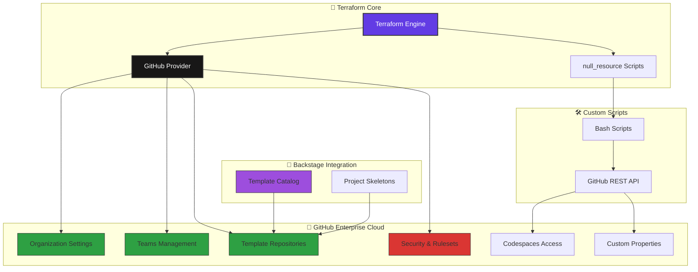

## 🚀 Quickstart: GHEC Org as Code

<!-- Badges -->
<p align="left">
   <a href="https://terraform.io/"></a>
   <a href="https://app.terraform.io/"></a>
   <a href="https://registry.terraform.io/providers/integrations/github/latest"></a>
   <a href="https://github.com/0GiS0/ghec-org-as-code/blob/main/LICENSE"></a>
   <a href="https://github.com/0GiS0/ghec-org-as-code/commits/main"></a>
   <a href="https://github.com/0GiS0/ghec-org-as-code/network/dependencies"></a>
</p>

Configura tu organización de GitHub Enterprise Cloud con Terraform en minutos. Este repo crea equipos, repositorios plantilla y protecciones de rama.

## 🏗️ Arquitectura del Sistema



---

## 🚀 Configuración Rápida (5 minutos)

### ⚡ Opción 1: Setup Automático (Recomendado)

```bash
# 1. Clonar el repositorio
git clone https://github.com/0GiS0/ghec-org-as-code.git
cd ghec-org-as-code

# 2. Ejecutar configuración guiada
./scripts/setup.sh

# 3. Aplicar cambios a tu organización
terraform plan    # 👀 Revisar cambios
terraform apply   # ✅ Aplicar a GHEC
```

### ⚙️ Opción 2: Configuración Manual

```bash
# 1. Configurar variables de entorno
cp .env.sample .env
nano .env  # Editar con tus credenciales

# 2. Cargar variables e inicializar (con Terraform Cloud)
source scripts/load-env.sh
terraform init 

# 3. Planificar y aplicar
terraform plan
terraform apply
```

> 📚 **¿Primera vez?** Consulta la [Guía de Configuración Completa](docs/SETUP.md)  
> ☁️ **Estado remoto**: Este proyecto usa **Terraform Cloud** para gestionar el estado de forma segura
terraform init 

# 3. Planificar y aplicar
terraform plan
terraform apply
```

> 📚 **¿Primera vez?** Consulta la [Guía de Configuración Completa](docs/SETUP.md)

## 📋 Componentes del Proyecto

| 🎯 Componente | 📝 Propósito | 📁 Archivos Clave |
|---------------|--------------|-------------------|
| 🏢 **Organización** | Configuración GHEC y seguridad | `main.tf`, `github-security-config.tf` |
| 👥 **Equipos** | Gestión de teams y permisos | `teams.tf` |
| 📦 **Repositorios** | Template repositories | `repository-template-*.tf` |
| 🛡️ **Seguridad** | Rulesets y protecciones | `org-rulesets.tf` |
| 🏷️ **Custom Properties** | Metadatos de repositorios | `custom_properties.tf` |
| 💻 **Codespaces** | Acceso a dev environments | `codespaces.tf` |
| 🧪 **Plantillas Backstage** | Esqueletos de proyectos | `software_templates/` |
| 🛠️ **Scripts** | Integraciones personalizadas | `scripts/terraform-integration/` |

---

## ✅ Requisitos

- Terraform CLI ≥ 1.6
- Una GitHub App instalada en tu organización (con la clave privada .pem)
- Archivo `.env` configurado con tus credenciales

> **💡 Tip**: Usa `./scripts/setup.sh` para configuración automática guiada

### 🔐 Permisos de la GitHub App (imprescindibles)

Para autenticación, este repo usa exclusivamente la GitHub App (sin PAT ni GITHUB_TOKEN). Asegúrate de otorgar como mínimo:

- Organización:
   - Administration: Read and write
   - Members: Read and write
   - Codespaces: Read and write (necesario para gestionar el acceso de Codespaces de la organización)
   - Codespaces secrets: Read and write (recomendado si más adelante se gestionan secretos de Codespaces)
   - Custom properties: Read and write (para gestionar propiedades personalizadas de repositorios)
- Repositorio:
   - Administration: Read and write
   - Contents: Read and write
   - Custom properties: Read and write (para gestionar propiedades personalizadas de repositorios)
   - Metadata: Read
- Actions: Read and write (si gestionas workflows/templates de CI)
- Workflows: Read and write (para poder añadir workflows/templates de CI)
- Acceso a repositorios: All repositories

Sugeridos (opcionales): Pull requests: Read, Checks: Read.

Nota: La App debe estar instalada en la organización objetivo y el `installation_id` debe corresponder a esa instalación.

---

## ⚙️ Configuración

### 🔧 Variables de Entorno (Recomendado)

1) **Configura variables de entorno**:

```bash
# Usar script de configuración automática
./scripts/setup.sh

# O manualmente:
cp .env.sample .env
nano .env
```

2) **Cargar variables**:

```bash
source scripts/load-env.sh
```

### 📝 Terraform.tfvars (Alternativo)

También puedes usar `terraform.tfvars` para configuración específica:

```bash
cp terraform.tfvars.example terraform.tfvars
```

Edita `terraform.tfvars` con tu organización:

```hcl
github_organization        = "tu-organizacion"
github_app_id              = "123456"
github_app_installation_id = "12345678"
github_app_pem_file        = "tu-github-app.pem"

# Email de facturación de la organización (requerido)
github_organization_billing_email = "billing@tu-org.com"

# Equipos (opcional)
platform_team_maintainers = ["platform-lead", "infra-admin"]
platform_team_members     = ["engineer1", "engineer2"]
```

> **Nota**: Si usas tanto `.env` como `terraform.tfvars`, las variables en `terraform.tfvars` tienen prioridad.

### 🔐 Seguridad de Archivos Sensibles

**Archivos que NO deben ser commiteados**:
- `.env` - Variables de entorno con credenciales reales
- `*.pem` - Claves privadas de GitHub App
- `terraform.tfvars` - Variables de Terraform con datos reales

**Verificar configuración de seguridad**:

```bash
# Verificar que archivos sensibles están en .gitignore
cat .gitignore | grep -E "(\.env|\.pem|terraform\.tfvars)"

# Verificar permisos del archivo PEM
chmod 600 tu-github-app.pem
ls -la *.pem

# Cargar y validar configuración
source scripts/load-env.sh
```

**Buenas prácticas**:
- Usar `.env.sample` como referencia para nuevos desarrolladores
- Mantener archivos PEM con permisos 600
- Rotar credenciales regularmente
- No incluir información sensible en documentación o commits

### 🔒 Configuración de Seguridad Avanzada

Por defecto, este repositorio habilita **GitHub Advanced Security** para todos los nuevos repositorios en la organización, incluyendo:

- ✅ **Advanced Security** - Análisis de código y vulnerabilidades
- ✅ **Dependabot Alerts** - Alertas de dependencias vulnerables
- ✅ **Dependabot Security Updates** - Actualizaciones automáticas de seguridad
- ✅ **Dependency Graph** - Gráfico de dependencias
- ✅ **Secret Scanning** - Detección de secretos
- ✅ **Secret Scanning Push Protection** - Prevención de push con secretos

Estas configuraciones se aplican automáticamente a todos los repositorios creados después de ejecutar `terraform apply`. Los repositorios existentes mantendrán su configuración actual.

Para personalizar estas configuraciones, puedes modificar las variables en `terraform.tfvars`:

```hcl
# Deshabilitar alguna característica específica si es necesario
# secret_scanning_push_protection_enabled_for_new_repositories = false
```

3) Asegúrate de que el archivo PEM exista y sea legible:

```bash
# Verificar que el archivo PEM existe
ls -l tu-github-app.pem

# Configurar permisos seguros
chmod 600 tu-github-app.pem
```

### 👥 Importante: miembros de la organización

- Antes de listar usuarios en `platform_team_members`, `template_approvers_members`, `security_team_members` o `read_only_team_members`, asegúrate de que esos usuarios YA aparecen en la sección People de la organización.
- No es necesario asignarlos manualmente a ningún team, solo que sean miembros de la org.
- En organizaciones EMU (Enterprise Managed Users), la pertenencia a la org se gestiona vía IdP/SCIM y Terraform/ la GitHub App NO pueden invitarlos. Si el usuario no está en People, el `apply` fallará con un 422 (EMU must be part of the organization).

---

## ▶️ Ejecución

Ejecuta desde la raíz del repo y no canceles los comandos:

```bash
terraform init
terraform fmt -check
terraform validate
terraform plan
terraform apply
```

Durante el `apply`, se realiza una llamada a la API de GitHub para configurar el acceso a Codespaces de la organización usando un token de instalación de la App. Los logs de diagnóstico se escriben en `/tmp/codespaces-org-access.log`.

> ☁️ **Terraform Cloud**: Este proyecto está configurado para usar Terraform Cloud como backend remoto para gestionar el estado de forma segura.

---

## 🏷️ Propiedades Personalizadas

Esta implementación incluye soporte para **custom properties** de GitHub, que proporcionan metadatos estructurados a los repositorios:

### Propiedades Definidas

- **service-tier**: Clasificación del nivel de servicio (tier-1, tier-2, tier-3, experimental)
- **team-owner**: Equipo responsable del mantenimiento del repositorio
- **demo**: Indica si el repositorio es para demostración (yes, no) - se configura automáticamente como "yes" para repos creados vía Backstage

### Configuración

Las propiedades personalizadas están habilitadas por defecto. Para deshabilitarlas:

```hcl
enable_custom_properties = false
```

### Integración con Backstage

Las plantillas de Backstage incluyen formularios para configurar estas propiedades automáticamente al crear nuevos repositorios.

📖 **Documentación completa**: [docs/CUSTOM_PROPERTIES.md](docs/CUSTOM_PROPERTIES.md)

---

## 🎛️ Custom Properties

Este repositorio gestiona custom properties organizacionales para clasificar y etiquetar repositorios automáticamente:

### Propiedades disponibles

- **service-tier**: Clasificación de nivel de servicio (`tier-1`, `tier-2`, `tier-3`, `experimental`)
- **team-owner**: Equipo responsable del mantenimiento del repositorio
- **demo**: Identifica repositorios de demostración (`yes`, `no`) - automáticamente configurada como "yes" para repositorios creados vía Backstage

### Configuración

Las custom properties se gestionan mediante una combinación de:
1. **Script personalizado** (`scripts/custom_property.sh`) para crear las definiciones organizacionales
2. **Provider nativo de Terraform** para aplicar valores a repositorios específicos

Esto permite gestionar funcionalidades no completamente soportadas por el provider de Terraform.

### Control de errores

- `custom_properties_non_fatal_404 = false` (modo estricto): Errores 404 fallan el apply
- `custom_properties_non_fatal_404 = true` (modo permisivo): Errores 404 se tratan como advertencias

---

## 🔧 Integraciones mediante Scripts

Para funcionalidades de GitHub que no están completamente soportadas por el provider de Terraform, este repositorio implementa un patrón de integración mediante scripts:

### Patrón de implementación

1. **Script bash** (`scripts/`) que interactúa directamente con la API de GitHub REST
2. **Recurso `null_resource`** en Terraform que ejecuta el script con variables de entorno
3. **Validación y logs** detallados para troubleshooting
4. **Manejo de errores** configurable (fatal vs. no fatal)

### Ventajas del patrón

- ✅ **Flexibilidad**: Acceso completo a la API de GitHub REST
- ✅ **Testeable**: Scripts pueden ejecutarse independientemente para testing
- ✅ **Trazabilidad**: Logs detallados en `/tmp/` para debugging
- ✅ **Configurable**: Control granular de comportamiento de errores
- ✅ **Reutilizable**: Patrón aplicable a otras funcionalidades no soportadas

### Ejemplo: Custom Properties

```hcl
resource "null_resource" "org_custom_properties" {
  for_each = var.enable_custom_properties ? var.organization_custom_properties : {}

  triggers = {
    org      = var.github_organization
    payload  = local.custom_properties_payloads[each.key]
    property = each.key
  }

  provisioner "local-exec" {
    interpreter = ["/bin/bash", "-c"]
    command     = "scripts/custom_property.sh"
    environment = {
      ORG_NAME         = var.github_organization
      PROPERTY_NAME    = each.key
      PROPERTY_PAYLOAD = local.custom_properties_payloads[each.key]
      # ... credenciales de GitHub App
    }
  }
}
```

---

## 🧩 Solución de problemas

- Resource not accessible by integration:
   - Verifica que la App esté instalada en la org correcta y con “All repositories”.
   - Habilita en Organización → Members: Read (requerido), Administration: Read and write y Codespaces: Read and write.
   - Confirma que `github_app_installation_id` corresponde a esa instalación.

- Error al configurar Codespaces (HTTP 4xx/5xx):
   - Revisa `/tmp/codespaces-org-access.log`.
   - Confirma que la App tiene el permiso Organization → Codespaces: Read and write.

- Error al configurar Custom Properties (HTTP 4xx/5xx):
   - Revisa `/tmp/custom-properties-*.log`.
   - Confirma que la App tiene el permiso Organization → Custom properties: Read and write.
   - Verifica que no existe conflicto con propiedades existentes.

- No se encuentra el PEM:
   - Usa ruta absoluta en `terraform.tfvars` y que el archivo exista con permisos 600.

---

## 🎉 Listo

Al aplicar, se crearán equipos bajo el parent `canary-trips`, repositorios plantilla y protecciones de rama con checks requeridos.
