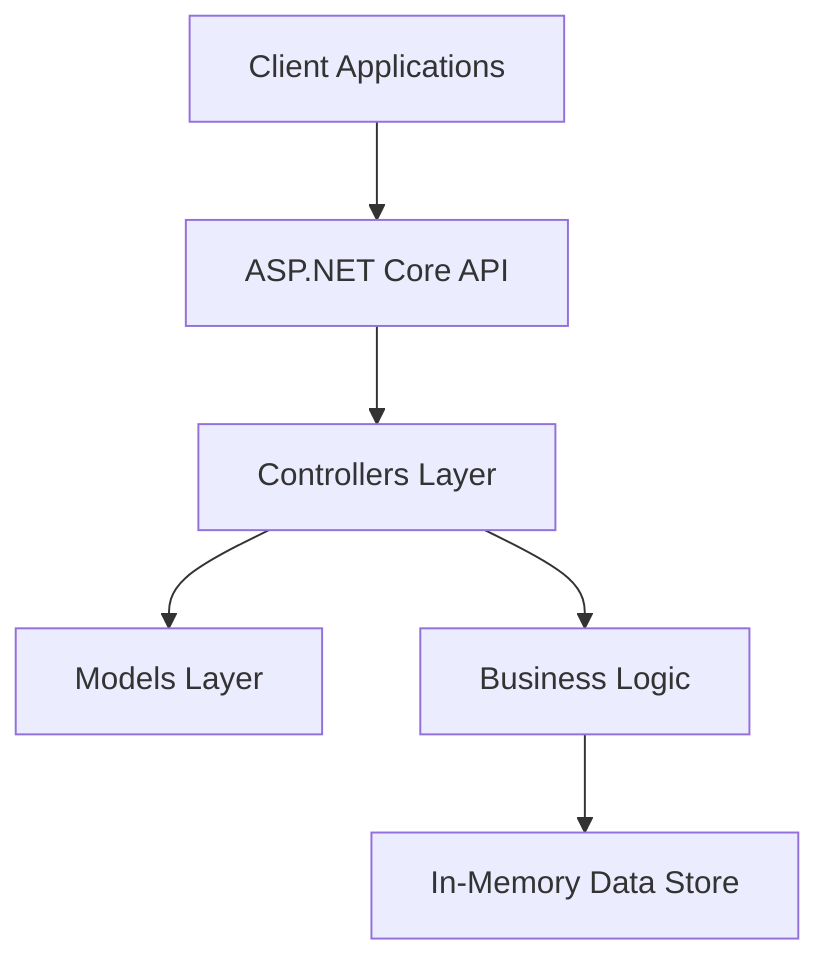
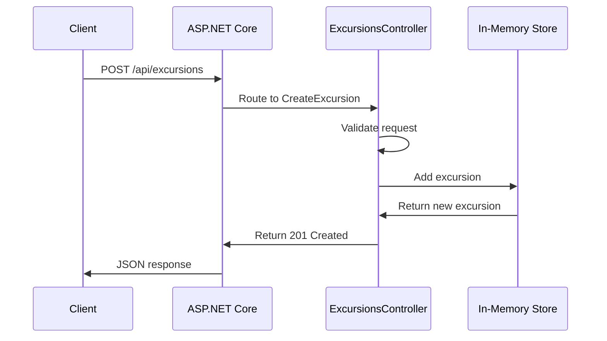

# Architecture

This document provides a comprehensive overview of the BACKSTAGE_ENTITY_NAME service architecture, design patterns, and technical decisions.

## Overview

BACKSTAGE_ENTITY_NAME is built using ASP.NET Core 9.0, following modern web API development practices with emphasis on maintainability, testability, and performance.

## High-Level Architecture



## Project Structure

### Source Code Organization

```text
src/
├── Controllers/          # API Controllers
│   ├── ExcursionsController.cs
│   ├── HealthController.cs
│   ├── HelloController.cs
│   └── StatusController.cs
├── Models/              # Data Models and DTOs
│   └── ApiModels.cs
├── Program.cs           # Application Bootstrap
└── BACKSTAGE_ENTITY_NAME.csproj
```

### Controllers Layer

The controllers layer handles HTTP requests and responses, implementing the RESTful API endpoints.

#### ExcursionsController
- **Purpose**: Manages CRUD operations for excursions
- **Endpoints**: GET, POST, DELETE operations
- **Responsibilities**:
  - Request validation
  - Business logic coordination
  - Response formatting
  - Error handling

#### HealthController
- **Purpose**: Provides detailed health status
- **Endpoints**: GET /health
- **Response**: JSON health information including service status, timestamp, and version

#### HelloController
- **Purpose**: Simple endpoint for connectivity testing
- **Endpoints**: GET /api/hello
- **Usage**: API testing and service verification

#### StatusController
- **Purpose**: Service status and metadata
- **Endpoints**: GET /api/status
- **Information**: Service uptime, environment, and operational status

### Models Layer

The models layer defines data structures and transfer objects.

#### Core Models

**Excursion**
```csharp
public class Excursion
{
    public int Id { get; set; }
    public string Name { get; set; }
    public string Description { get; set; }
    public string Location { get; set; }
    public decimal Price { get; set; }
    public int Duration { get; set; }
    public int MaxParticipants { get; set; }
}
```

**CreateExcursionRequest**
```csharp
public class CreateExcursionRequest
{
    public string Name { get; set; }
    public string Description { get; set; }
    public string Location { get; set; }
    public decimal Price { get; set; }
    public int Duration { get; set; }
    public int MaxParticipants { get; set; }
}
```

## Design Patterns

### Repository Pattern (In-Memory Implementation)

The service uses a simplified in-memory data storage pattern for demonstration purposes:

```csharp
private static readonly List<Excursion> _excursions = new()
{
    // Seed data
};
```

**Benefits**:
- Simplicity for demonstration
- No external dependencies
- Fast performance
- Easy testing

**Production Considerations**:
- Replace with persistent storage (SQL Server, PostgreSQL, etc.)
- Implement proper repository pattern
- Add database migrations

### Dependency Injection

ASP.NET Core's built-in DI container manages service lifetimes:

```csharp
// Built-in services
builder.Services.AddControllers();
builder.Services.AddHealthChecks();
builder.Services.AddSwaggerGen();

// Custom services would be registered here
// builder.Services.AddScoped<IExcursionService, ExcursionService>();
```

### Async/Await Pattern

All controller actions use async/await for non-blocking operations:

```csharp
[HttpGet]
public async Task<ActionResult<IEnumerable<Excursion>>> GetAllExcursions()
{
    // Async implementation
}
```

## Configuration

### Application Startup

The `Program.cs` file configures the application pipeline:

```csharp
var builder = WebApplication.CreateBuilder(args);

// Service registration
builder.Services.AddControllers();
builder.Services.AddEndpointsApiExplorer();
builder.Services.AddSwaggerGen();
builder.Services.AddHealthChecks();
builder.Services.AddCors();

var app = builder.Build();

// Middleware pipeline
if (app.Environment.IsDevelopment())
{
    app.UseSwagger();
    app.UseSwaggerUI();
}

app.UseHttpsRedirection();
app.UseCors();
app.UseAuthorization();
app.MapControllers();
app.MapHealthChecks("/health");
```

### CORS Configuration

Cross-Origin Resource Sharing is configured to allow all origins for development:

```csharp
builder.Services.AddCors(options =>
{
    options.AddDefaultPolicy(policy =>
    {
        policy.AllowAnyOrigin()
              .AllowAnyMethod()
              .AllowAnyHeader();
    });
});
```

**Production Note**: Restrict CORS to specific origins in production environments.

## Data Flow

### Request Processing Flow

1. **HTTP Request** → Client sends request to API endpoint
2. **Routing** → ASP.NET Core routing matches URL to controller action
3. **Model Binding** → Request data is bound to action parameters
4. **Controller Action** → Business logic is executed
5. **Response Formation** → Result is serialized to JSON
6. **HTTP Response** → Response is sent back to client

### Example: Create Excursion Flow



## Error Handling

### Global Error Handling

The application uses ASP.NET Core's built-in error handling:

- **Development**: Detailed exception information
- **Production**: Generic error messages

### Custom Error Responses

Controllers return structured error responses:

```csharp
if (excursion == null)
{
    return NotFound($"Excursion with id {id} not found");
}
```

## Security Considerations

### Current Implementation

- **No Authentication**: Currently open API for demonstration
- **CORS**: Configured for development (allow all origins)
- **HTTPS Redirection**: Enabled for secure communication

### Production Recommendations

- **Authentication**: Implement JWT or OAuth 2.0
- **Authorization**: Role-based access control
- **Rate Limiting**: Prevent abuse
- **Input Validation**: Comprehensive validation rules
- **CORS**: Restrict to specific origins
- **Security Headers**: Add security-related headers

## Performance Considerations

### Current Optimizations

- **Async Operations**: Non-blocking I/O operations
- **Minimal Allocations**: Efficient memory usage
- **Built-in Caching**: ASP.NET Core response caching

### Scalability Considerations

- **Stateless Design**: No server-side session state
- **Horizontal Scaling**: Suitable for multiple instances
- **Database**: Replace in-memory store with persistent storage
- **Caching**: Implement distributed caching (Redis)
- **Load Balancing**: Support for multiple instances

## Monitoring and Observability

### Health Checks

Built-in health checks provide service status:

- **Endpoint**: `/health`
- **Custom Checks**: Extensible for database, external services
- **Integration**: Ready for monitoring systems

### Logging

Structured logging using ASP.NET Core's ILogger:

```csharp
_logger.LogInformation("Getting excursion with id: {Id}", id);
_logger.LogWarning("Excursion with id {Id} not found", id);
```

**Log Levels**:
- Information: Normal operations
- Warning: Potentially harmful situations
- Error: Error events but application continues

## Testing Architecture

### Integration Testing

Comprehensive integration tests using `WebApplicationFactory`:

- **Test Host**: In-memory test server
- **Real HTTP**: Actual HTTP requests/responses
- **Full Pipeline**: Tests entire request pipeline
- **Database**: In-memory data for testing

### Test Structure

```text
tests/
├── ApiTests.cs              # Integration tests
└── BACKSTAGE_ENTITY_NAME.Tests.csproj
```

## Future Enhancements

### Recommended Improvements

1. **Persistent Storage**
   - Entity Framework Core
   - Database migrations
   - Connection pooling

2. **Authentication & Authorization**
   - JWT token validation
   - Role-based permissions
   - API key authentication

3. **Advanced Features**
   - Caching layer (Redis)
   - Message queuing
   - Event-driven architecture
   - Background services

4. **Observability**
   - Application Insights
   - Distributed tracing
   - Metrics collection
   - Health check UI

5. **API Versioning**
   - URL-based versioning
   - Header-based versioning
   - Backward compatibility

This architecture provides a solid foundation for building scalable web APIs while maintaining simplicity for development and testing.
